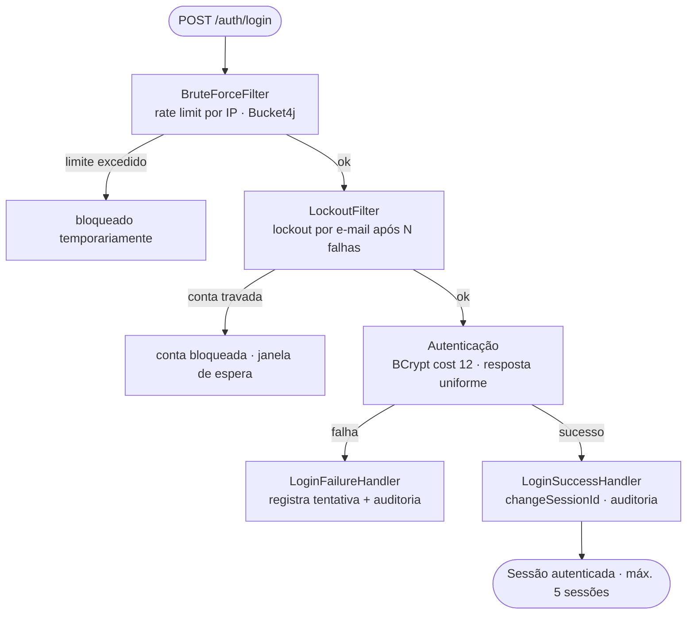

<h1 align="center">💸 Rastro$</h1>

<p align="center">
  <strong>Controle financeiro pessoal multiusuário — com segurança de nível bancário</strong>
</p>

<p align="center">
  <em>Despesas, receitas, cartões, contas e investimentos num só lugar —<br/>
  construído com arquitetura limpa, defesa em profundidade e testes de verdade.</em>
</p>

<p align="center">
  
  
  
  
  
  
  
</p>

<p align="center">
  <a href="#-o-que-este-projeto-demonstra">O que demonstra</a> •
  <a href="#-funcionalidades">Funcionalidades</a> •
  <a href="#-segurança-em-camadas">Segurança</a> •
  <a href="#️-arquitetura">Arquitetura</a> •
  <a href="#️-stack">Stack</a> •
  <a href="#-como-rodar">Como rodar</a>
</p>

---

## 📋 Visão geral

O **Rastro$** é um sistema web para **controle financeiro pessoal**: despesas variáveis, receitas, cartões e contas, além de investimentos (cofrinhos/metas e carteira). Um dashboard consolida KPIs — quanto entrou, quanto saiu, o que está pago, o que vence — com gráficos de evolução de saldo e distribuição por categoria.

Como o sistema lida com **dinheiro real e dados financeiros**, ele foi construído com uma postura de **segurança como requisito de primeira classe** e **correção de domínio** levada a sério: cada usuário só enxerga os próprios dados (isolamento reforçado por testes), valores monetários nunca sofrem erro de ponto flutuante, e todo o histórico é auditável.

> Este repositório é uma peça de portfólio: uma demonstração de **backend Spring Boot bem arquitetado, seguro e testado**.

---

## 🛡️ O que este projeto demonstra

> Não é um CRUD. É uma demonstração de **engenharia backend com disciplina de segurança, arquitetura e testes**.

| Competência | Onde aparece no código |
|---|---|
| **Segurança em profundidade** | rate limit por IP (Bucket4j) + lockout por e-mail + BCrypt-12 + CSP estrita + CSRF + headers, em camadas independentes |
| **Autenticação robusta** | verificação por código de e-mail, aprovação por admin, resposta uniforme em login falho, `changeSessionId` anti-fixation |
| **Arquitetura limpa (MVC estrito)** | *Controller* fino · *Service* com `@Transactional` · *Repository* sem regra; a `Entity` nunca cruza a camada web (DTO via MapStruct) |
| **Isolamento por usuário** | toda query filtra por `user_id`; acesso a recurso alheio retorna **404** (não vaza existência) — comprovado por teste |
| **Correção de domínio financeiro** | dinheiro como `BIGINT` (centavos), datas em **UTC** (`TIMESTAMPTZ`), IDs `UUID` |
| **Defesa contra SQL injection** | JPA parametrizado → Bean Validation → whitelist de caracteres → usuário de app sem DDL |
| **Migrations versionadas** | schema 100% em **Liquibase** (changelogs com `id`/`author`/`rollback`, nunca editar aplicado) |
| **Testes de verdade** | **144 testes** com **Testcontainers** (Postgres real, não H2) + gate de cobertura JaCoCo |
| **Observabilidade & i18n** | Actuator (health/metrics), auditoria append-only, PT-BR/EN via `MessageSource` |

---

## ✨ Funcionalidades

### 🔐 Autenticação & conta
- Cadastro com **verificação por código de e-mail** e **aprovação por administrador**.
- Recuperação/redefinição de senha e troca de senha no perfil.
- Política de senha forte (`PasswordPolicy`); sessão renovada no login.

### 📊 Dashboard
- **KPIs**: recebido, gasto, pago, a pagar e saldo.
- **Gráficos**: evolução do saldo (linha) e distribuição por categoria (donut).
- Vencimentos próximos e resumo por conta.

### 💳 Cartões & Contas
- CRUD de cartões e contas, com saldo da fatura e dias de fechamento/vencimento.

### 💰 Despesas & Receitas
- Despesas variáveis com filtros, **marcar como pago**, **parcelas e recorrência**.
- Receitas com lançamento, edição e listagem.

### 🏦 Investimentos
- **Cofrinhos** (metas) e **carteira** (CDB, Tesouro, LCI, limite garantido) com histórico e rendimento mensal.

### 🌐 Transversais
- **Multi-idioma** PT-BR (padrão) / EN, tema claro/escuro, seletor de período e **ocultar valores** (privacidade na tela).

---

## 🔐 Segurança em camadas

O diferencial do projeto. A autenticação não é "verifica a senha e pronto" — é uma **cadeia de defesas independentes**, cada uma cobrindo uma classe de ataque:



**Autenticação & sessão**
- Senhas com **BCrypt (cost 12)**; **resposta uniforme** em login falho (não distingue "senha errada" de "usuário inexistente").
- **Session fixation** mitigado com `changeSessionId`; limite de **5 sessões** simultâneas por usuário.

**Brute force (defesa em profundidade)**
- **Camada 1 — rate limit por IP** com **Bucket4j** (`BruteForceFilter`).
- **Camada 2 — lockout por e-mail** após N falhas consecutivas (`LockoutFilter` + `LockoutChecker`).
- **Camada 3 — registro** de cada tentativa (`login_attempts`) e **auditoria** para análise.

**Web hardening**
- **CSP estrita** (sem `unsafe-inline` → por isso o front não tem CSS/JS inline), **HSTS**, `X-Frame-Options: DENY`, `Referrer-Policy`.
- **CSRF** habilitado em todos os formulários; escape automático do Thymeleaf (sem `th:utext` com input do usuário).

**Dados**
- **SQL injection** barrado em 4 camadas: JPA parametrizado → Bean Validation → whitelist de caracteres → usuário de banco sem permissão DDL.
- **Isolamento por usuário**: toda operação filtra por `user_id`; acesso a recurso alheio devolve **404**.
- **Auditoria append-only** de login/logout, falhas e mudanças sensíveis.

---

## 🏗️ Arquitetura

**MVC estrito**, server-side, com fronteiras rígidas entre as camadas:

```
View (Thymeleaf) ⇄ Controller ⇄ Service ⇄ Repository ⇄ PostgreSQL
     (sem inline)     (fino)   (@Transactional)  (sem regra)
```

- **Controller** fino: recebe, valida (`@Valid`), delega, escolhe a view. Sem regra de negócio.
- **Service** concentra a regra e o `@Transactional`.
- **Repository** (Spring Data JPA) só acessa dados — métodos como `findByIdAndUserId(...)`.
- A **Entity nunca atravessa a camada web** — sempre convertida em DTO/Form via **MapStruct**.

```
src/main/java/com/rastroos/
├── config/     # SecurityConfig, LocaleConfig, OpenApiConfig, ClockConfig
├── security/   # BruteForceFilter, LockoutFilter, PasswordPolicy, AuditLogger,
│               #   CustomUserDetails(Service), Login(Success|Failure)Handler
├── domain/
│   ├── entity/     # Account, Transaction, Income, Investment, User, AuditLog, ...
│   ├── repository/ # Spring Data JPA (sempre filtrando por user_id)
│   ├── service/    # regra de negócio + @Transactional
│   └── mapper/     # MapStruct (Entity ↔ DTO)
└── web/
    ├── controller/ # telas Thymeleaf   ├── rest/  # endpoints /api/v1
    ├── dto/ · form/ # transporte e entrada validada
    └── advice/      # GlobalExceptionHandler

src/main/resources/
├── db/changelog/   # Liquibase (master + changelogs versionados)
├── messages/       # i18n pt-BR / en
├── templates/      # layout, fragments, auth/, app/, modals/
└── static/css|js/  # arquivos separados, sem inline (exigido pela CSP)
```

### 🔑 Decisões de engenharia
- **Dinheiro como `BIGINT` (centavos)** — conversão para `BigDecimal` só no DTO; zero erro de ponto flutuante.
- **UTC no banco** (`TIMESTAMPTZ`); fuso do usuário só na apresentação.
- **Separação por usuário ≠ multi-tenant** — sem schemas separados; isolamento por filtro consistente e testado.
- **Injeção via construtor** com campos `final`, **sem Lombok** (getters/equals/hashCode à mão).

---

## 🛠️ Stack

### Backend
| Tecnologia | Papel |
|---|---|
| **Java 25 LTS · Spring Boot 3.5.6** | Base da aplicação |
| **Spring Security 6** | Autenticação, autorização, CSRF, headers, CSP |
| **Spring Data JPA + Hibernate** | Persistência parametrizada |
| **Liquibase** | Migrations versionadas do schema |
| **MapStruct 1.6** | Mapeamento Entity ↔ DTO |
| **Bucket4j 8.10** | Rate limiting (defesa de brute force) |
| **springdoc-openapi 2.7** | Swagger UI |

### Frontend
| Tecnologia | Papel |
|---|---|
| **Thymeleaf** | Motor de templates — renderiza as telas (HTML) no servidor (SSR) com fragments; **sem SPA** |
| **HTML/CSS/JS** | Arquivos separados, **sem inline** (compatível com a CSP) |
| **Chart.js** | Gráficos do dashboard |

### Banco, Testes & Infra
| Tecnologia | Papel |
|---|---|
| **PostgreSQL 16** | Banco relacional (container em dev) |
| **Testcontainers 1.21** | Postgres real e efêmero nos testes |
| **JUnit 5 · Mockito · MockMvc** | Unitários e integração |
| **JaCoCo** | Cobertura com gate mínimo no domínio |
| **Docker / Docker Compose · Actuator** | Infra local e observabilidade |

---

## 🧪 Testes

**144 testes** seguindo a pirâmide — ~70% unitários (Service), ~25% integração leve (`@WebMvcTest`/`@DataJpaTest`), ~5% integração completa (`@SpringBootTest`). Repositórios e integração rodam contra um **Postgres real via Testcontainers** (nada de H2).

```bash
./mvnw test      # unitários + integração leve
./mvnw verify    # + cobertura JaCoCo (gate mínimo no domínio)
```

Toda feature inclui, por padrão, teste de **isolamento por usuário** (usuário B não vê dados do A) e de **autorização** (não-admin bloqueado em rota admin) — além do caminho feliz e da validação de entrada.

---

## 🚀 Como rodar

### Pré-requisitos
- **Java 25**, **Docker** + **Docker Compose**. O **Maven** vem no wrapper `./mvnw` (não precisa instalar).
- No **Linux** e no **WSL2** o setup roda direto; no **Windows nativo**, use o **WSL2** — o script detecta e orienta.

### ⚡ Setup automático (recomendado)

O script [`setup.sh`](./setup.sh) prepara o ambiente com **um único comando**: valida o **JDK 25** e o **Maven Wrapper**, gera um **`.env` de DEV funcional** (com as credenciais que a app espera por padrão), **baixa as dependências e compila**, e sobe o **PostgreSQL** (via [`scripts/db-up.sh`](./scripts/db-up.sh)).

```bash
./setup.sh
```

Acompanhe cada etapa com **barra de progresso e porcentagem**:

```
[5/5] Banco de dados (PostgreSQL)
  ██████████████████████████████ 100%
```

**Opções:**

| Comando | O que faz |
|---------|-----------|
| `./setup.sh` | Setup completo |
| `./setup.sh -y` | Não-interativo |
| `./setup.sh --no-docker` | Não sobe o Postgres |
| `./setup.sh -h` | Ajuda |

> **Idempotente**: pode rodar de novo com segurança — um `.env` já existente é **preservado**. Ao final, basta rodar a aplicação (passo 3️⃣).

<details>
<summary>🔧 <strong>Setup manual (passo a passo)</strong> — alternativa ao <code>setup.sh</code></summary>

#### 1️⃣ Variáveis de ambiente
```bash
cp .env.example .env
# preencha POSTGRES_USER / POSTGRES_PASSWORD / POSTGRES_DB
# e RASTROOS_APP_SECRET  (ex.: openssl rand -base64 48)
```

#### 2️⃣ Banco
```bash
./scripts/db-up.sh          # ou: docker compose up -d postgres
```

</details>

### 3️⃣ Aplicação (perfil dev)
```bash
./mvnw spring-boot:run -Dspring-boot.run.profiles=dev
```
As migrations do Liquibase rodam no boot. Acesse **http://localhost:8080** · Swagger UI em **/swagger-ui.html**.

> O admin inicial é criado uma vez pelo changelog `003-create-default-admin.xml` com `password_must_change=true` — o primeiro login serve só para trocar a senha.

---

## 🗺️ Roadmap

Implementação **incremental por etapas** (detalhe em [`Projeto.md`](./Projeto.md)):

| # | Etapa | Status |
|:-:|-------|:------:|
| 0–2 | Bootstrap · Infra Docker/Postgres · Esqueleto Spring Boot | ✅ |
| 3–4 | Schema (Liquibase) · Entities & Repositories | ✅ |
| 5–6 | Spring Security & Autenticação · Templates + assets | ✅ |
| 7 | Dashboard + Cartões/Contas | ✅ |
| 8–9 | Despesas · Receitas | ✅ |
| 10 | Investimentos | ✅ |
| 11 | Relatórios + Comparativo | ⏳ |
| 12 | Suporte (tickets) | ⏳ |
| 13 | **Alfredo** — assistente financeiro com IA | ⏳ |
| 14 | Admin: gestão de usuários | ⏳ |
| 15–16 | Swagger completo · Hardening final | ⏳ |
| 17–19 | Observabilidade · Cobertura · Deploy | ⏳ |

> **Legenda:** ✅ concluída · ⏳ planejada

---

## 📚 Documentação complementar

| Documento | Conteúdo |
|-----------|----------|
| [`Projeto.md`](./Projeto.md) | Plano de implementação completo (escopo, modelo de dados, segurança, etapas) |
| [`CLAUDE.md`](./CLAUDE.md) | Regras de arquitetura, segurança e convenções |

---

## 📄 Licença

Projeto pessoal de portfólio. Todos os direitos reservados.

---

## 👨‍💻 Autor

Desenvolvido por **Wallace Campista** — backend, segurança de aplicações e arquitetura limpa.

---

<p align="center">
  
  
</p>
